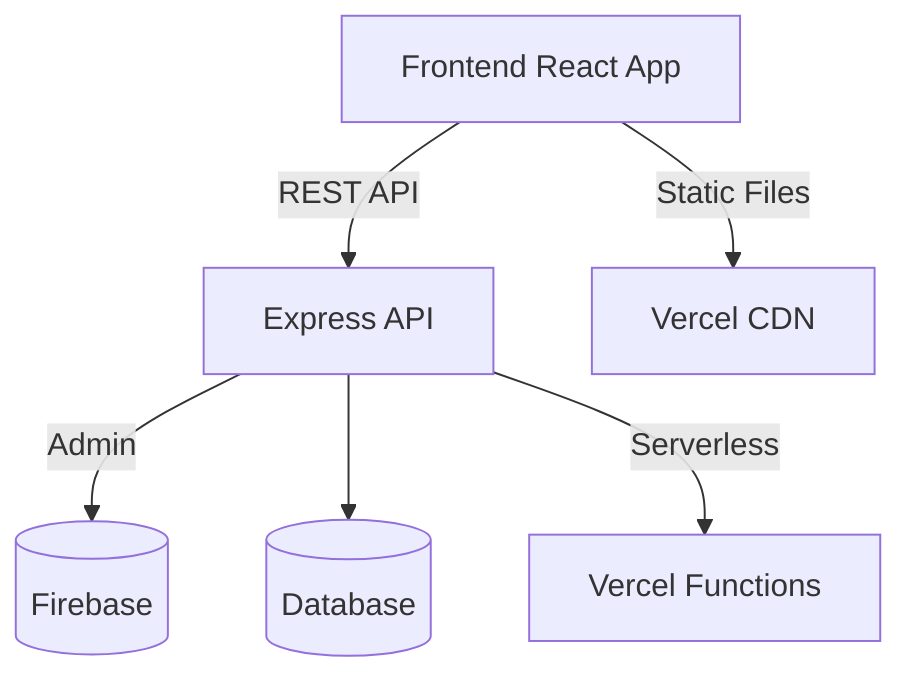

# Backend-Frontend Separation Migration Plan

## Current Architecture Overview

- Frontend: React application with direct Firebase integration
- Authentication: Firebase Auth
- Database: Firestore
- Storage: Firebase Storage
- Deployment: Combined frontend/backend on Vercel

## Target Architecture



## Migration Steps

### 1. Backend Setup

- Create `api/` directory at project root
- Initialize Express server with these key endpoints:
  - `/api/auth/login` (POST)
  - `/api/auth/register` (POST)
  - `/api/admin` (Protected routes)
- Implement JWT authentication layer
- Maintain Firebase as persistence layer initially

### 2. Frontend Changes

- Create new `services/` directory for API calls
- Replace all direct Firebase auth calls with API service calls
- Implement auth context with JWT tokens
- Update ProtectedRoute to validate JWT tokens

### 3. Deployment Strategy

- Separate Vercel projects:
  - `frontend-vercel`: Static site build
  - `backend-vercel`: Serverless functions
- Configure CORS for API access

### Timeline

1. Week 1: API implementation and testing
2. Week 2: Frontend integration
3. Week 3: Deployment and monitoring

### File Structure Changes

```
project-root/
  ├── api/                # New backend
  │   ├── auth/
  │   ├── middlewares/
  │   └── vercel.json
  ├── src/
  │   ├── services/       # New API services
  │   └── ...             # Existing frontend
  └── vercel.json         # Frontend config
```

## Risk Mitigation

- Phase 1: Run old and new auth in parallel
- Phase 2: Switch to new auth with fallback
- Phase 3: Complete migration with monitoring

Would you like me to proceed with implementing any part of this plan?
